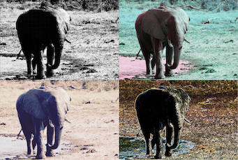

ImageFilterWrapper
=======================
[](https://travis-ci.com/adempsey/ImageFilterWrapper)



Apple's Core Image framework provides an extensive API for image filtering, but its syntax can be a bit unintuitive and lacks features common in modern Swift libraries. Take the following example, where we apply a Gaussian blur to a UIImage for display:

```
if let imageUI = UIImage(named: "example.png"),
   let input = CIImage(image: imageUI) {
    let context: CIContext = CIContext(options: nil)
    let rect: CGRect = input.extent

    let blurFilter = CIFilter(name:"CIGaussianBlur")
    blurFilter?.setValue(input, forKey: kCIInputImageKey)
    blurFilter?.setValue(25.0, forKey: kCIInputRadiusKey)

    if let output: CIImage = blurFilter?.value(forKey: kCIOutputImageKey) as? CIImage,
       let cgOutputImage: CGImage = context.createCGImage(output, from: rect) {
        let outputImageUI = UIImage(cgImage: cgOutputImage)
    }
}
```
With ImageFilterWrapper, this is reduced to:

```
import ImageFilterWrapper
if let inputImage = UIImage(named: "example.png") {
    let filter: ImageFilter = .Blur(.Gaussian(radius: 25.0))
    let filteredImage = inputImage.applyFilters(filter)
}
```
In addition, IFW offers:

* __Type-safe parameters__: incorrectly formatted arguments to image filter parameters are flagged at build time, rather than runtime
* __Core Image Object extensions__: Apply filters directly to UIImages, and pass parameters as Core Graphics objects, without converting to Core Image formats
* __Autocompletion__: Built entirely on Swift enums, available filters will be shown as the developer types through Xcode's autocompletion system
* __Inline Documentation__: Option-click any filters in IFW to view high-level descriptions and available parameters

## Installation
Coming soon